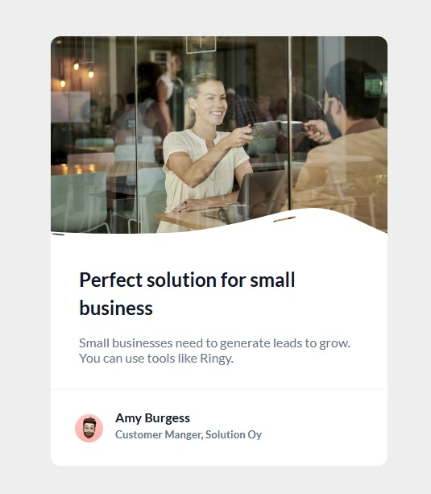

# Business Blog Card: UI Component

This project is a **historical practice** from my early stages in web development. I keep it in my portfolio as a record of my technical trajectory, showing how I mastered CSS fundamentals before moving on to complex Fullstack architectures.

---

## 🚀 Demo
[SEE DEMO HERE](https://cmp2007.github.io/Business-Blog-Card-UI-Component/)

---

### Screenshot

---

## 📋 Evolution & Context Note
> ⚠️ **Note on my trajectory:** This repository is part of my **past projects** and does not represent my current modern capabilities in Fullstack development. At the time of this exercise, my goal was to master `position: absolute` and `transform` to handle complex visual layers. Today, these foundations allow me to build advanced interfaces in React, but I preserve this code in its original state as evidence of my learning curve.

## 📋 Technical Milestones of this Stage
In this specific phase of my training, I successfully achieved:

* **Layer Management:** Implementation of `z-index` and absolute positioning to overlay SVG shapes on top of images, a key skill for UI fidelity.
* **Visual Accuracy:** Faithful recreation of a professional business design, focusing on spacing and typography hierarchy using the 'Lato' family.
* **Component Detailing:** Mastering circular clipping (`border-radius: 50%`) and layered borders to create polished UI elements like avatars.
* **Introduction to Flexbox:** First implementations of flexible containers to align author information and footer metadata.

## 🛠️ Technologies (at the time)
* **HTML5:** Basic semantic structure.
* **CSS3:** Positioning, Flexbox, and Google Fonts integration.
* **SVG:** Direct manipulation of vector paths for custom UI effects.
